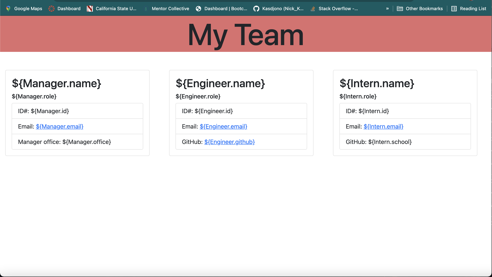

# Project Name : Engineering Team Generator
<br/>

## Application Link
<br/>

["Link to video demonstration"](https://kasdjono.github.io/task-organizer/)  
<br/>

## This program creates a webpage that displays a newly created team.
<br/>
<br/>

## The following features have been added to the page:

```md
- A command-line application that accepts user input  
- The user prompted for my team members and their information  
- HTML file is generated that displays a nicely formatted team roster based on user input  
- Email links are functional on the generated HTML file  
- GitHub links are functional on the generated HTML file  
- In the terminal the user is prompted to enter the team manager’s name, employee ID, email address, and office number  
- After the data is inputed the user is sees a menu with the option to add an engineer or an intern or to finish building my team  
- If the user selects the engineer option they are prompted to enter the engineer’s name, ID, email, and GitHub username, and then taken back to the selection menu  
- If the user selects the intern option they are prompted to enter the intern’s name, ID, email, and school, and I am taken back to the selection menu  
- If the user decides to finish building my team the application will exit the application, and the HTML is generated  
```

## Screen shot of the application's web page:
<br/>





<br/>

## Liscence:  

  